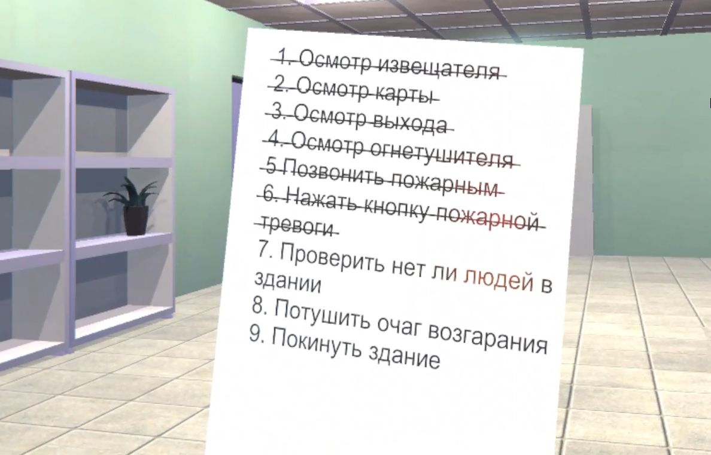
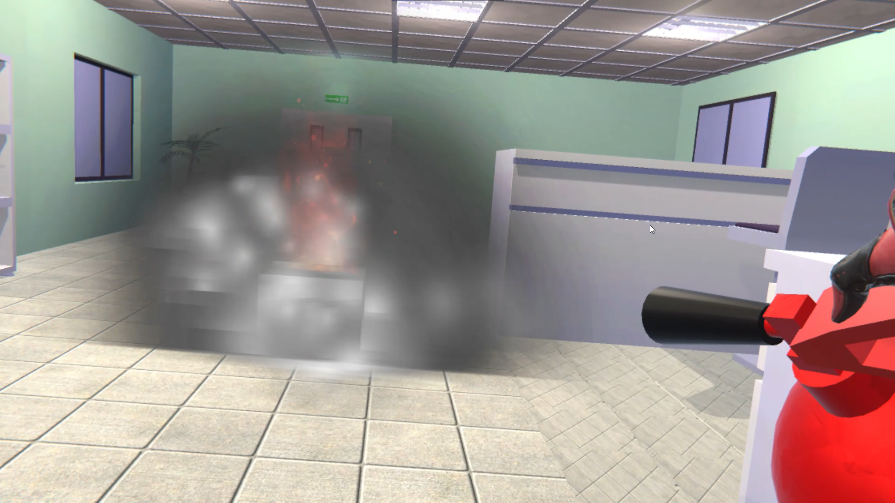
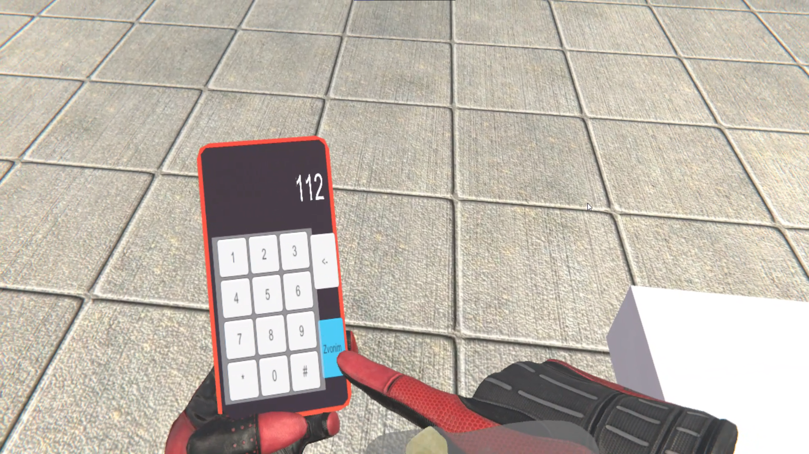

# Fire Safety Simulation for Unity

**Note:** Unfortunately, the final Unity project files were lost. You can still explore the completed version by running the build located in the `GameBuild` folder. This folder contains the executable for the final simulation, allowing you to experience the project as it was intended.

This Unity-based fire safety simulation offers an interactive experience designed to train users on proper actions and protocols during a fire emergency. It combines essential fire safety procedures, task-based guidance, and realistic interactions, making it a valuable tool for educational and training environments.

##

## Features

- **Step-by-Step Task List**: A guided list of fire safety tasks walks the user through key actions to take in case of a fire. Tasks include checking the fire detector, reviewing escape routes, and inspecting the fire extinguisher. As tasks are completed, they’re crossed off, allowing users to track their progress easily.

- **Countdown Timer**: A timer adds urgency to the simulation, creating a realistic pressure to act quickly. This helps users practice staying calm and efficient under time constraints.

- **Evacuating People**: The simulation teaches users how to assist in safely evacuating people from the building, focusing on both speed and thoroughness.

- **Using a Fire Extinguisher**: Users can pick up and use a fire extinguisher to put out the source of the fire. To make it realistic, they’ll first need to remove the safety pin before using the extinguisher.

  

- **Activating the Fire Alarm**: Users can manually activate the fire alarm to alert others in the building, simulating the action of raising an alarm for evacuation.

- **Phone Simulation with Fire Department Call**: The simulation includes a virtual phone interface, allowing users to dial the fire department. After dialing, a series of questions simulates a conversation with the operator, providing a realistic experience of what information needs to be conveyed in an emergency.

  

## Included Tasks

1. Inspect the fire detector.
2. Review the map.
3. Check the emergency exit.
4. Inspect the fire extinguisher.
5. Call the fire department.
6. Press the fire alarm button.
7. Ensure no people remain in the building.
8. Extinguish the source of the fire.
9. Exit the building.

## Getting Started

1. Open the `GameBuild` folder and launch the executable to explore the completed simulation.
2. Use the simulation to practice essential fire safety protocols and evaluate your emergency response skills.

---

# Симуляция Пожарной Безопасности для Unity

**Примечание:** К сожалению, финальные файлы проекта Unity были утеряны. Вы можете ознакомиться с завершённой версией, запустив сборку, которая находится в папке `GameBuild`. В этой папке содержится исполняемый файл симуляции, позволяющий увидеть проект в задуманном виде.

Эта симуляция, созданная в Unity, предлагает интерактивное обучение действиям и протоколам, которые следует соблюдать в случае пожара. Она сочетает ключевые процедуры пожарной безопасности, пошаговые инструкции и реалистичные взаимодействия, делая её полезным инструментом для образовательных и учебных целей.

##

## Особенности

- **Список Заданий**: Пошаговый список заданий по пожарной безопасности помогает пользователю последовательно выполнять важные действия во время пожара. В задания входят проверка извещателя, осмотр эвакуационных выходов и осмотр огнетушителя. По мере выполнения задачи зачеркиваются, что позволяет легко отслеживать прогресс.

- **Таймер**: Таймер добавляет срочности, создавая давление времени и напоминая о необходимости действовать быстро. Это помогает пользователям отработать умение сохранять спокойствие и действовать эффективно в условиях ограниченного времени.

- **Эвакуация Людей**: Симуляция обучает, как помогать эвакуировать людей из здания, уделяя внимание как скорости, так и тщательности.

- **Использование Огнетушителя**: Пользователи могут взять огнетушитель и потушить очаг возгорания. Для реалистичности перед использованием нужно снять защитную чеку.

  

- **Активация Пожарного Извещателя**: Пользователь может вручную активировать пожарный извещатель, чтобы предупредить остальных в здании и имитировать процесс подачи сигнала на эвакуацию.

- **Симуляция Вызова Пожарных**: В симуляцию включён интерфейс виртуального телефона, с помощью которого можно вызвать пожарную службу. После набора номера появляется список вопросов, имитирующий разговор с диспетчером, что добавляет реализма и обучает, какую информацию следует передавать в экстренной ситуации.

  

## Задания в Симуляции

1. Осмотр извещателя.
2. Осмотр карты.
3. Осмотр выхода.
4. Осмотр огнетушителя.
5. Вызов пожарной службы.
6. Нажатие кнопки пожарной тревоги.
7. Проверка отсутствия людей в здании.
8. Тушение очага возгорания.
9. Покинуть здание.

## Начало Работы

1. Откройте папку `GameBuild` и запустите исполняемый файл, чтобы ознакомиться с завершённой симуляцией.
2. Используйте симуляцию для отработки навыков пожарной безопасности и оценки своих действий в чрезвычайной ситуации.
